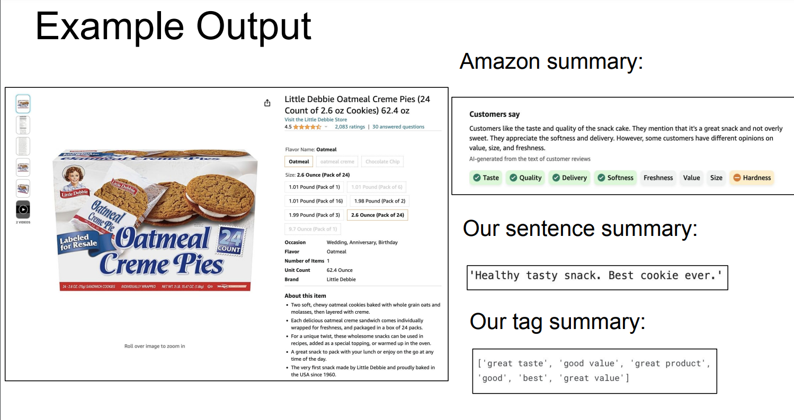

# Product Review Summarization

## Introduction
We have developed an application to summarize product reviews from e-commerce websites like Amazon and eBay. This tool provides a concise summary of the overall sentiment from numerous reviews, saving users the effort of reading each one.

## Project Overview
### Why It's Interesting
Our application uses Natural Language Processing (NLP) to summarize and extract key aspects ("tags") from product reviews. These tags reflect crucial factors considered by customers, such as taste, quantity, or texture for food products.

### Technologies Used
- **NLP Methods & Models**: We focused on summarization techniques and context retention.
- **Main Model**: Sequence to Sequence (Seq2Seq) model. We had two models in our final implementation, one trained on a subset of the initial "Amazon Fine Food Review" dataset to provide longer summaries and another on the entire dataset to develop tags (both are used in evaluation).
- **Other Techniques**: Clustering (DBSCAN, k-means), pre-trained summarizers (BERT/TextRank).

## Implementation
### Data & Preprocessing
- **Dataset**: Amazon Fine Foods dataset, containing around 500,000 food reviews.
- **Preprocessing Steps**: Text lowercasing, stopwords removal, tokenization, punctuation removal.
- **Dataset Subsetting**: Used for specific models to meet criteria like minimum token count.

### Seq2Seq Model
- **Architecture**: Encoder-decoder setup with LSTM layers, dropout techniques, and attention mechanisms.
- **Encoder**: Processes input text, maintaining context.
- **Decoder**: Generates output text with attention to specific parts of the input.
- **Inference**: Uses `decode_sequence` function for generating coherent summaries.

### End-to-End Flow
1. Gather food product reviews from Amazon.
2. Feed reviews into the Seq2Seq model for initial phrase extraction.
3. Cluster phrases using DBSCAN.
4. Summarize each cluster with the Seq2Seq model.
5. Compare results with actual Amazon review summaries using a sentence similarity metric.

## Results & Evaluation
- **Outputs**: Short summaries and positive/negative tags.
- **Evaluation Method**: Word embedding similarity, comparing outputs to Amazon's summaries and tags.
- **Performance**: Tags scored a mean of 0.681, and sentence summaries scored 0.534 in similarity.

## Future Work
- **Model Improvement**: Train Seq2Seq with sentence-based labels; consider using GPT-4 for label generation.
- **Expanded Dataset**: Include more products and reviews for broader testing.
- **Application Expansion**: Adapt tool for service, restaurant, or location reviews.

## Explanation of each file in this repository and how they contributed to the overall project
- **Condensing Clustered Reviews.ipynb**: Demonstrate clustering using DBSCAN which is used in our End2End pipeline (described above).
- **Data Preprocessing.ipynb**: Clean (stemming and removing stopwords) reviews for training the Seq2Seq model.
- **Model Evaluation.ipynb**: A prelimary check that our models were in fact working.
- **Seq2Seq Training.ipynb**: Train the Seq2Seq model using the preprocessed data. 
- **Summaries to Sentences.ipynb**: An attempt at using the GPT-2 model to convert our shorter summaries into full developed sentences. (Not used in final pipeline but an experiment)
- **t5-model.ipynb**: Train a pre-trained T5 (Text-to-Text Transfer Transformer) model on our data. (Not used in final pipeline but an experiment)
- **Using Pre-trained models**: Used pre-trained models from Hugging Faces transformer library (T5, Bart, PEGASUS) without further training on our data. (Not used in final pipeline but an experiment)
- **create-evaluation-dataset.ipynb**: All of our copy and pasted reviews from Amazon we used in evaluation.
- **end2end-sentence.ipynb**: The actual evaluation taking place using the model trained on a subset of the dataset (all of the summaries with length >= 3).
- **end2end-tags.ipynb**: Same as the previous file (our evaluation) but using the model trained on the whole dataset and develops shorter tags.
- **evaluate_gpt2_summaries.ipynb**: We attempted to train a GPT-2 model to help us enhance our dataset by providing slightly longer reviews. This file is where the GPT-2 model further trained on our dataset is imported and evaluated. (Not used in final pipeline but an experiment).
- **gpt2-training.ipynb**: Used to train the GPT-2 model using our data.
- **model_evaluation_reviews.csv**: The Amazon reviews as well as the ground truth summaries and tags (from Amazon's website) we used to evaluate the performance of our model.
- **Product Review Summarization Project Report.pdf**: Project report (see for more details about the project)
- **Presentation Slides.pdf**: Our presentation slides (see for short summary of the finalized project as a whole).
